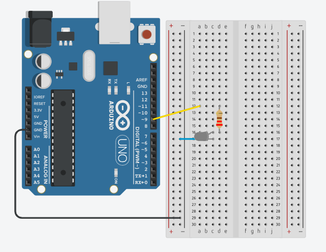

# Quick Start for Arduino UNO

This project is intended for user with an Arduino UNO and only requires an IR LED and a 220 Ohm resistor.

#### Arduino Setup
Connect Digital Pin 9 to an IR LED through a 220 Ohm resistor.  This sketch does not use the TX pin to regulate the signal.

You may add IR LEDs to improve detection but must reduce the resistor value appropriatly.

#### Sending Signals
The file `index.html` contains a simple interface for creating and sending signals to the Arduino to trigger the IR code transmission.  

To connenct to a COM device you need a computer running Windows 10 or above (or similarly new Mac OS) and a compatible browser (Chromer or Edge). 

Chrome does not require the HTML file run from a server, but other browser will require this as a security measure.  You can open the `index.html` file in Chrome or start a local python web server by running `python run.py` and navigating to http://localhost:8080 to access the interface.

###### Connecting

Select "Connect" and you should see a menu to select available COM devices.  Choose the Arduino UNO with the IR Blaster sketch.

###### Location Codes

The Park selector lists available parks.  This only lists known parks in the US, you can modify this list of include parks worldwide if you know the code.

The Location input allows two HEX values that determine the specific location in the park.

Clicking "BLAST SINGLE" will show the COM transmission in the textbox and you should see the IR sensor blink if you point a cellphone cammera at it.  If a Pal Mickey is within range of the IR LED it should vibrate indicating that it has received the signal.

###### Discovery Scanner

Using the auto-scan you can iterate through location codes for the current park one-by-one until you get a response from Pal Mickey.  This can be helpful in finding new codes.

**Note:**
If you want to discover new parks, try modifying this code to iterate through park codes with a static location code.

